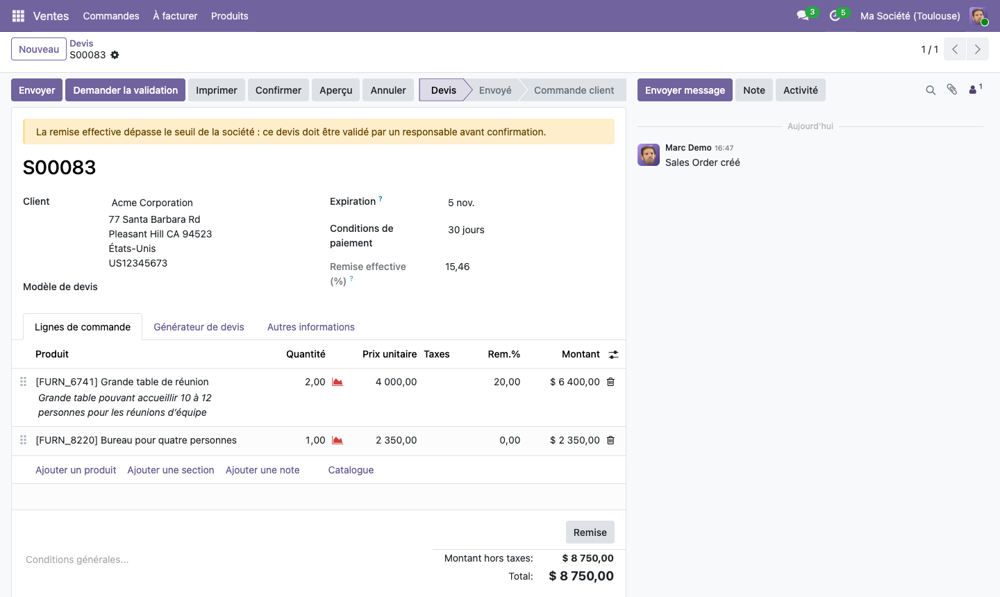
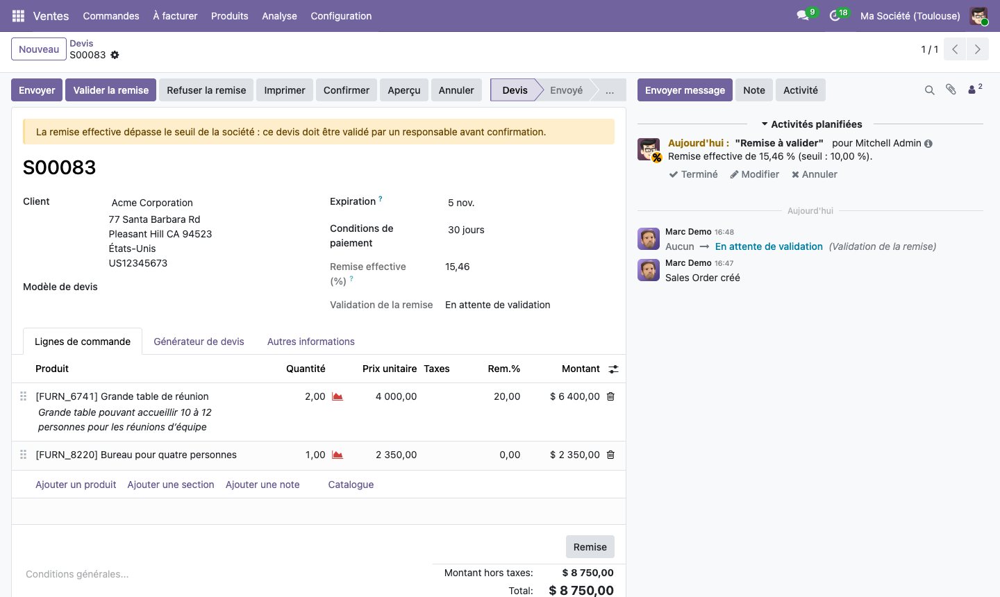
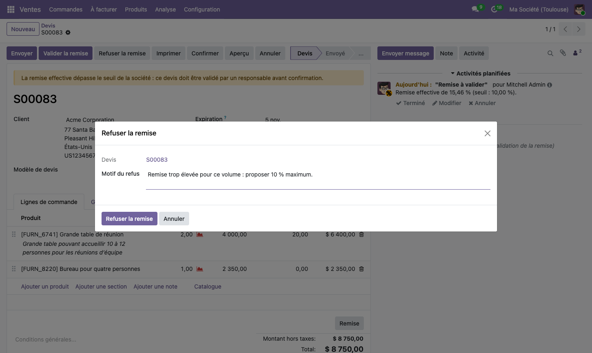

# Validation des remises sur devis — module Odoo 19

[](https://github.com/gaguaoussamaa/odoo19-sale-discount-approval/actions/workflows/tests.yml)

Module pour Odoo 19 Community. Un devis dont la **remise effective** dépasse un seuil doit être **validé par un responsable** avant d'être confirmé.

> Module d'entraînement sur Odoo 19 Community (octobre 2026) : héritage du standard, sécurité, workflow de validation et tests. Il ne vient pas d'un projet client et n'a pas été utilisé en production.



## Le besoin métier

> « Les devis dont la remise dépasse un seuil doivent être validés par un responsable avant confirmation. »

- Le seuil se règle **par société** (10 % par défaut), dans **Ventes › Configuration › Paramètres**.
- La remise mesurée est la **remise effective du devis**, pas seulement la colonne « Rem. % ». Une remise globale ajoutée avec le bouton **Remise** compte aussi.
- Au-delà du seuil, le commercial ne peut pas confirmer : il **demande une validation**. Un responsable **valide**, ou **refuse avec un motif**.
- Si la remise **augmente après validation**, il faut **valider de nouveau**.

### Avant de coder : ce qu'Odoo propose déjà
- **Achats** : une double validation native, avec un montant seuil par société. Les ventes n'ont pas d'équivalent.
- **Studio** (Enterprise) : des règles d'approbation sur un bouton, qui couvrent une bonne partie de ce besoin sans code.
- **OCA** : des modules de blocage ou d'approbation existent en 19, mais ils ne correspondent pas exactement à cette règle de remise effective.

Chez un client, ces options passeraient en premier. Ici, l'objectif était de pratiquer le développement natif en restant au plus près du standard.

## Le parcours

| Étape | Qui | Ce qui se passe |
|---|---|---|
| 1 | Commercial | Il crée un devis, et Odoo calcule la remise effective. Au-delà du seuil, un bandeau s'affiche et la confirmation est refusée. |
| 2 | Commercial | **Demander la validation** : le devis passe « En attente de validation ». Chaque valideur reçoit une activité « Remise à valider ». Le devis apparaît dans **Ventes › Commandes › Devis à valider**. |
| 3a | Responsable | **Valider la remise** : la remise validée est mémorisée, et le commercial peut confirmer. |
| 3b | Responsable | **Refuser la remise** : un assistant demande un motif obligatoire. Le motif est publié en note interne et notifie le commercial. |
| 4 | Commercial | Si la remise augmente après validation, il faut faire une nouvelle demande. |

Un responsable peut aussi confirmer directement un devis au-delà du seuil. Sa validation est alors enregistrée.





## Architecture

```
sale_discount_approval/
├── __manifest__.py
├── models/
│   ├── res_company.py                 seuil par société, contrainte SQL (0 à 100 %)
│   ├── res_config_settings.py         le seuil dans les Paramètres (champ related)
│   └── sale_order.py                  remise effective, état de validation, actions, blocage
├── wizard/
│   └── sale_discount_refuse_wizard.py refus avec motif (TransientModel)
├── security/
│   ├── sale_discount_approval_security.xml   privilège et groupe « Valideur de remises »
│   └── ir.model.access.csv                   droits d'accès de l'assistant
├── data/
│   └── mail_activity_type_data.xml    type d'activité « Validation de remise »
├── views/
│   ├── sale_order_views.xml           formulaire hérité (xpath), filtre, action, menu
│   └── res_config_settings_views.xml  réglage du seuil
└── tests/
    └── test_discount_approval.py      8 tests
```

L'historique Git suit la construction étape par étape : le seuil, la remise effective, le groupe et les boutons, le blocage de la confirmation, les tests, puis les activités et le refus avec motif, et enfin le filtre et le menu.

## Choix techniques
- **La remise effective** se calcule ainsi : (montant HT avant remise − montant HT du devis) ÷ montant HT avant remise.
  - Le montant avant remise vient du standard (`amount_undiscounted`), qui ignore les lignes de remise globale et les acomptes.
  - Le champ est **stocké**, pour qu'on puisse filtrer et trier dessus. `amount_undiscounted` n'est ni stocké ni décoré par `@api.depends` : les dépendances portent donc sur des champs stockés (`amount_untaxed`, et la remise, le prix et la quantité des lignes).
- **Le blocage** se fait dans `_confirmation_error_message()`, avec `super()`. C'est le point d'extension qu'`action_confirm()` appelle pour chaque devis : on garde les contrôles du standard, et un seul endroit couvre le bouton Confirmer, la signature en ligne et le paiement en ligne.
- **`action_confirm()` est aussi surchargé**, pour autre chose : quand un valideur confirme lui-même un devis au-delà du seuil, sa validation est enregistrée avant l'appel à `super()`.
- **Un état de validation séparé** (`discount_approval_state`), plutôt qu'une valeur de plus dans `state`. Le champ `state` pilote le portail, le stock et la facturation : y toucher serait risqué.
- **Une validation couvre une remise précise** (`discount_approved_rate`). Si la remise augmente ensuite, la validation ne la couvre plus. Il n'y a pas besoin de surcharger `write`.
- **Le seuil est porté par la société**, comme celui de la double validation des achats. Il est exposé dans les Paramètres par un champ `related`, et protégé par une contrainte SQL écrite en `models.Constraint` (syntaxe 19).
- **Les conventions d'Odoo 19** sont respectées :
  - `res.groups.privilege` ;
  - `user_ids` et `all_user_ids` ;
  - les expressions dans `invisible` ;
  - `float_compare` pour comparer les remises ;
  - `formatLang` pour afficher les pourcentages selon la langue de l'utilisateur.

## Sécurité
- **Un groupe « Valideur de remises »**, avec son propre privilège dans la catégorie Ventes. Il implique « Ventes : tous les documents », pour voir les devis des autres commerciaux. Les responsables des ventes en font partie par implication.
- **Le contrôle est côté serveur.** Valider ou refuser lève une `AccessError` pour qui n'est pas valideur. L'attribut `groups` sur les boutons et sur le menu ne fait que les masquer : il ne protège pas les données.
- **OdooBot n'est jamais valideur.** Le superutilisateur fait partie des responsables des ventes, mais il n'est jamais considéré comme valideur. Une tâche planifiée, par exemple une confirmation après paiement en ligne, ne peut donc pas contourner la règle.
- **L'assistant de refus a ses propres droits d'accès**, réservés aux valideurs. Le motif est publié comme du texte, donc échappé.

## Tests
Les huit tests sont des `TransactionCase`. Ils utilisent des utilisateurs de test (`new_test_user`) et `with_user()`, et ne dépendent pas des données de démo. Ils vérifient que :
- sous le seuil, aucune validation n'est demandée ;
- au-dessus du seuil, la confirmation est bloquée ;
- après validation, la confirmation passe ;
- un commercial ne peut pas valider ;
- une remise augmentée après validation demande une nouvelle validation ;
- la remise globale du bouton Remise est prise en compte ;
- la demande crée une activité pour les valideurs ;
- le refus enregistre le motif et ferme les activités.

Ils tournent à chaque push avec GitHub Actions, sur Odoo 19 et PostgreSQL 16, avec le même `docker-compose.yml` que pour l'essai en local.

## Installation avec Docker
Seul Docker est nécessaire.

```bash
git clone https://github.com/gaguaoussamaa/odoo19-sale-discount-approval.git
cd odoo19-sale-discount-approval

# Crée une base de démonstration (avec le français) et installe le module
docker compose run --rm odoo odoo -d demo -i sale_discount_approval --with-demo --load-language=fr_FR --stop-after-init

# Démarre Odoo sur http://localhost:8069 (base « demo », identifiants admin / admin)
docker compose up -d
```

Pour lancer les tests :

```bash
docker compose run --rm odoo odoo -d demo -u sale_discount_approval --test-tags /sale_discount_approval --stop-after-init
```

Pour essayer :
1. Se connecter avec `demo` / `demo`, le commercial de la démo, et créer un devis avec une remise de 20 % sur une ligne.
2. Se connecter avec `admin` / `admin` pour valider ou refuser la remise.

Pour passer l'interface en français : Préférences › Langue.

## Limites et pistes
- Un prix unitaire baissé à la main, ou par une liste de prix, n'est pas compté comme une remise. Il faudrait le comparer au prix de la liste de prix.
- La confirmation est refusée côté serveur, mais un client peut encore voir l'option de signature en ligne d'un devis non validé. On pourrait la bloquer plus tôt.
- Les demandes en attente ne sont pas relancées automatiquement (ce serait une action planifiée).
- Les libellés sont écrits directement en français, sans fichiers de traduction.

## Licence
LGPL-3.0 (voir [LICENSE](LICENSE)), comme déclaré dans le manifeste.
